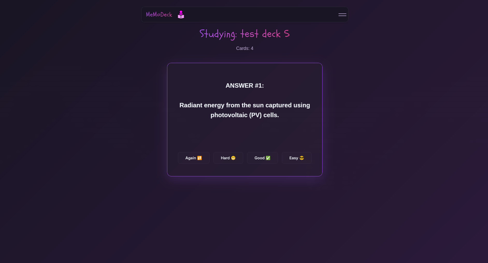

# MemoDeck



## About

A flashcard app built with Wails (Go + React/TypeScript) that uses AI to generate flashcards from your documents and helps you study with spaced repetition.

## What It Does

- Generate flashcards from uploaded files using AI
- Study your cards with spaced repetition (tracks when to show each card next)
- Store everything locally on your machine
- Works as a native desktop app

## Current Status

**Work in Progress**: I'm still implementing the spaced repetition algorithm. Once that's finished, I'll package this up properly for easier installation.

## Installation

Right now you'll need to build from source:

### Prerequisites

- Go 1.18+
- Node.js 16+
- Wails CLI: `go install github.com/wailsapp/wails/v2/cmd/wails@latest`

### Setup

```bash
npm install
go mod download
```

## Running

**Dev mode:**
```bash
wails dev
```

**Build:**
```bash
wails build
```

Built app will be in `build/bin`.

## How It Works

Decks are stored as JSON files in your config directory (`~/.config/memoDeck` on Linux/Mac, `%APPDATA%/memoDeck` on Windows). Each deck contains flashcards with questions, answers, and scheduling info for spaced repetition.
